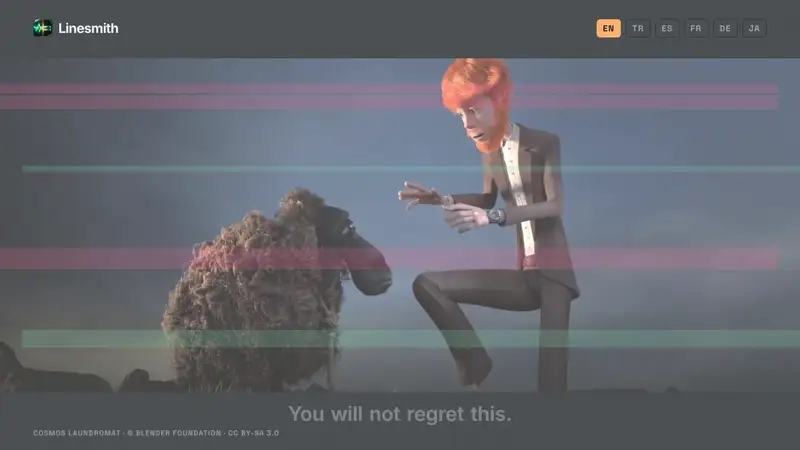
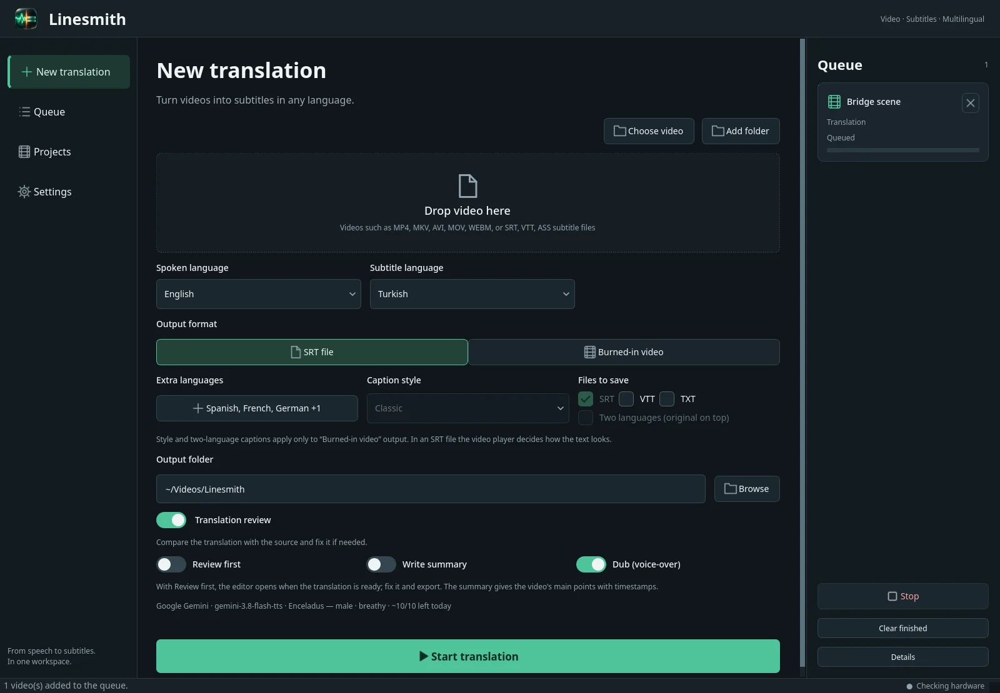
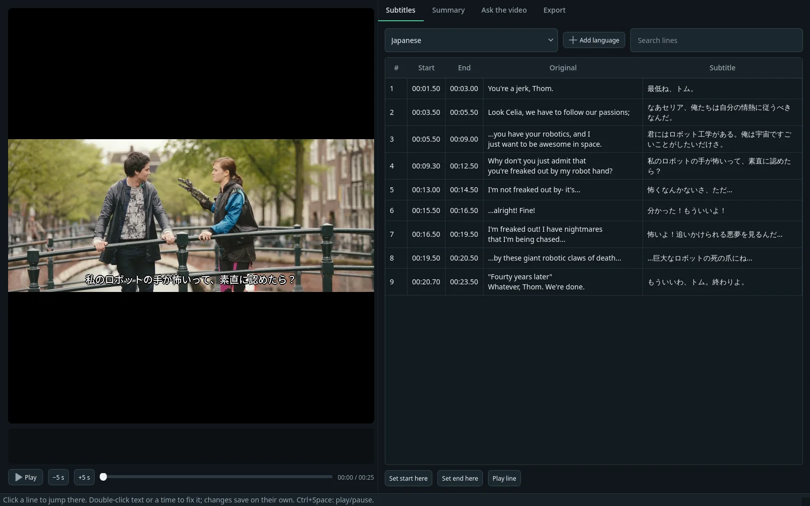
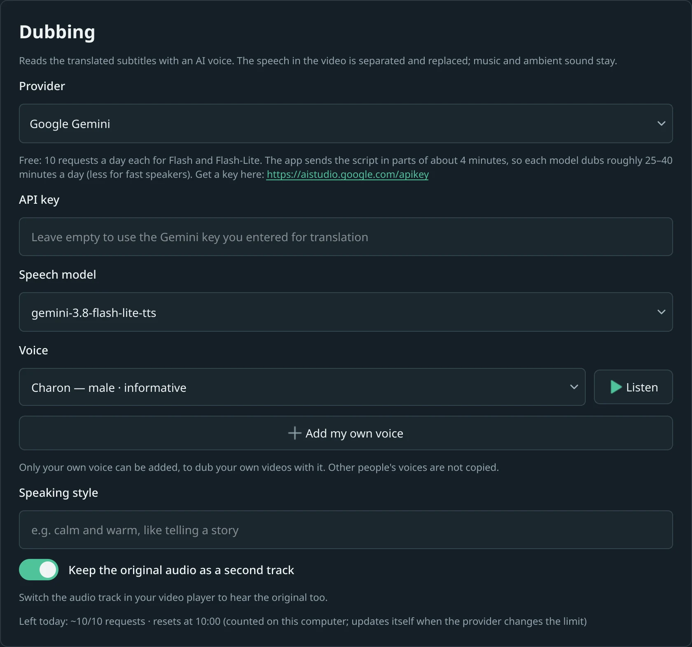

<p align="center">
  
</p>

<h1 align="center">Linesmith</h1>

<p align="center"><b>Your video, in their language.</b><br>
Subtitles, translation into 33 languages and AI dubbing, in one desktop app for Windows and Linux.</p>

<p align="center">
  <a href="https://github.com/Algo1493/linesmith/releases/latest"></a>
  
  <a href="https://algowisp.com/#pricing"></a>
</p>

<p align="center">
  <a href="https://algowisp.com/"></a>
  <br><sub>One scene, five new languages: every dub here was made with Linesmith and a Google Gemini voice. <a href="https://algowisp.com/">Watch it with sound →</a> or <a href="https://algowisp.com/#demo">try the demo</a>.<br><i>Cosmos Laundromat</i> © Blender Foundation, <a href="https://creativecommons.org/licenses/by-sa/3.0/">CC BY-SA 3.0</a>.</sub>
</p>

## What it does

- **Speech to subtitles** on your own computer (Whisper or Parakeet). An NVIDIA graphics card makes it much faster.
- **Translation into 33 languages** with the AI service you choose, checked against the original. Several languages in one run.
- **Dubbing** with Google Gemini, ElevenLabs, OpenAI or Azure voices. The voice is separated from the music and ambient sound, so only the speech changes; the original audio stays as a second track.
- **An editor** to fix any line or timing before you export or dub, plus summaries and questions about the video.
- **Exports:** SRT, VTT, TXT, or a video with burned-in subtitles in three styles, also bilingual.
- **Existing subtitles** (SRT, VTT, ASS, or a text track inside an MKV) are used instead of speech recognition.

Your video files never leave your computer. Only the subtitle text goes to the AI service you set up, or nowhere at all with a local model (Ollama, LM Studio).

## Download

| System | File |
| --- | --- |
| Windows 10/11, 64-bit | [`Linesmith-Setup.exe`](https://github.com/Algo1493/linesmith/releases/latest/download/Linesmith-Setup.exe) |
| Linux, x86-64 | [`Linesmith-x86_64.AppImage`](https://github.com/Algo1493/linesmith/releases/latest/download/Linesmith-x86_64.AppImage) |

On Linux, make the file executable and run it:

```bash
chmod +x Linesmith-x86_64.AppImage && ./Linesmith-x86_64.AppImage
```

Each release has a `SHA256SUMS.txt`. To check your download:

```bash
sha256sum -c SHA256SUMS.txt --ignore-missing
```

On first start, Linesmith installs its speech recognition components (a few GB with an NVIDIA graphics card).

## How it works

**1. Drop a video and pick the languages.** Add files or a whole folder, add more languages for the same run, and turn on dubbing if you want a voice.



**2. Check every line before it is spoken.** Linesmith checks its own translation against the original. Then you can read it next to the source, fix a word or a timing, and play the line in the video.



**3. Export subtitles, or a dubbed video.** Save SRT, VTT or text, burn the subtitles into the video, or dub it. Choose the voice service, model and voice, listen before you use it, or add your own voice with Gemini or ElevenLabs.



## Requirements

- **Computer:** Windows 10/11 64-bit or a 64-bit Linux desktop. An NVIDIA graphics card is recommended; on Windows, graphics card acceleration is experimental.
- **AI key:** from the service you choose, for example Google Gemini, which has a free tier. Local models through Ollama or LM Studio also work.
- **Files:** video and subtitle files on your computer. Linesmith does not download videos from websites.

## Pricing

The first 3 videos are free, with every feature. After that, Linesmith asks for a license key:

| Monthly | Yearly | Lifetime |
| --- | --- | --- |
| $19 / month | $129 / year | $249 once |

Every plan has every feature, and each license works on 2 computers. Buy at [algowisp.com](https://algowisp.com/#pricing); payments are handled by Polar.

## Help

- Website and FAQ: https://algowisp.com/
- Email: linesmith@algowisp.com

This repository hosts the installers and release notes. Linesmith is commercial software; its source code is not published here.

<sub>Preview: <i>Tears of Steel</i> © Blender Foundation | mango.blender.org, licensed under <a href="https://creativecommons.org/licenses/by/3.0/">CC BY 3.0</a>.</sub>
